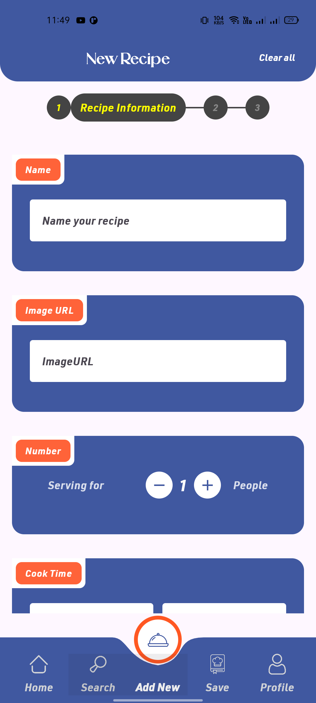
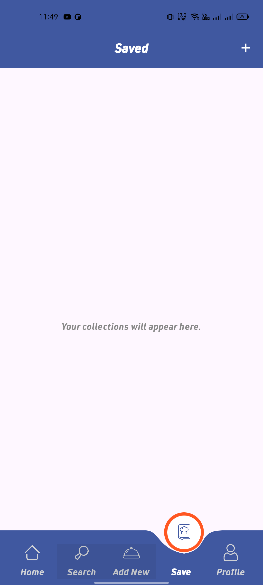
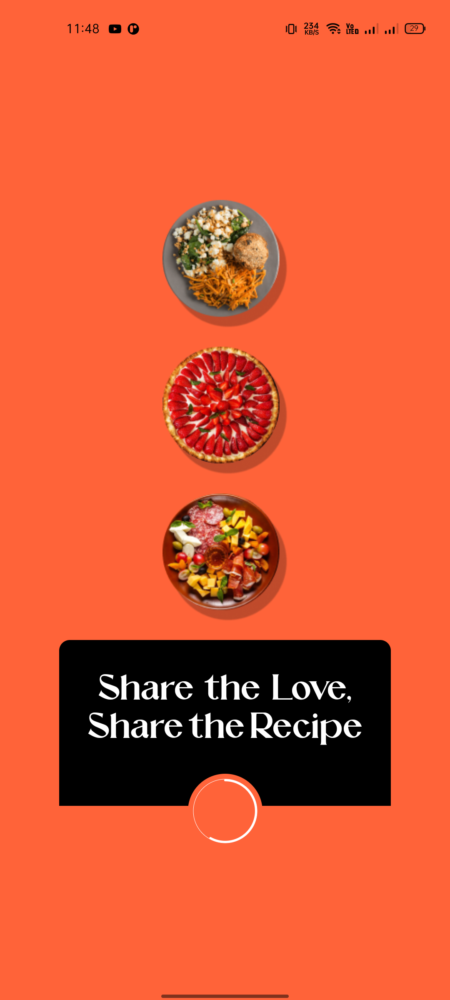

# 📱 RecipeBox

**RecipeBox** is a mobile app where users can create, organize, and browse their own recipes — all offline.  
It’s designed as a personal cooking companion that stores data locally on the device, so recipes are always available without internet access.

---

## 🚀 Features

- Add recipes with:
  - Title
  - Image (from gallery or placeholder)
  - Ingredients (dynamic cards)
  - Steps (dynamic cards)
  - Tags  

- 🔍 **Local Search** by:
  - Title  
  - Ingredients  
  - Tags  
  - With multiple filters applied simultaneously  

- 📂 **Saved Collections**:
  - Create, edit, and delete collections  
  - Many-to-many relation (a recipe can exist in multiple collections)  
  - Browse recipes inside each collection  

---

## 🖼️ Screenshots

| Splash & Onboarding | Add Recipe | Search Recipes |
|---------------------|------------|----------------|
|  |  |  |

| Saved Collections | On Boarding Screen |
|-------------------|-------------------|
|  |  |

---

## 📂 Project Structure

- **UI**: Jetpack Compose  
- **Architecture**: Clean Architecture + MVVM  
- **DI**: Hilt  
- **Data**: Room (Local DB)  
- **Navigation**: Compose Navigation  
- **State**: ViewModel state handling  
- **Media**: Image picker & placeholder handling  
- **Relations**: One-to-many & many-to-many (Recipes ↔ Collections)  

---

## 🗂️ Entities

- `Recipe`  
- `Collection`  
- `CollectionRecipeCrossRef`  
- `Profile`  

---

## 📝 Deliverables

- ✅ Functional app matching provided Figma design  
- ✅ Room database with entities and relations  
- ✅ Local search with Flow  
- ✅ Editable & deletable collections  
- ✅ **APK file**  
- ✅ **Screenshots** (see section above)  
- ✅ **Demo Video**  

---

## 📦 Tech Stack

- [Kotlin](https://kotlinlang.org/)  
- [Jetpack Compose](https://developer.android.com/jetpack/compose)  
- [Room Database](https://developer.android.com/jetpack/androidx/releases/room)  
- [Hilt](https://developer.android.com/training/dependency-injection/hilt-android)  
- [MVVM Architecture](https://developer.android.com/jetpack/guide)  

---

## 📌 Notes

- App works fully offline  
- Figma design followed exactly  
- Uses local DB only (no API integration)  

---
